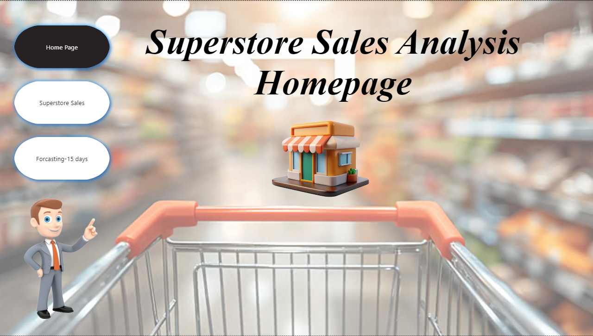
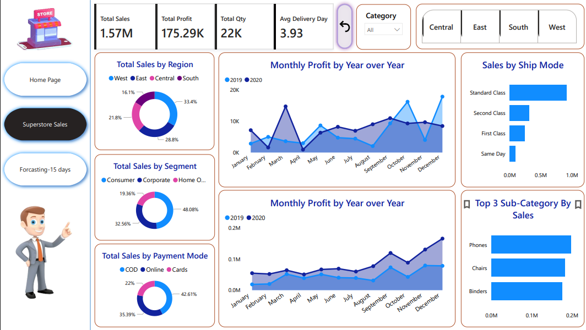
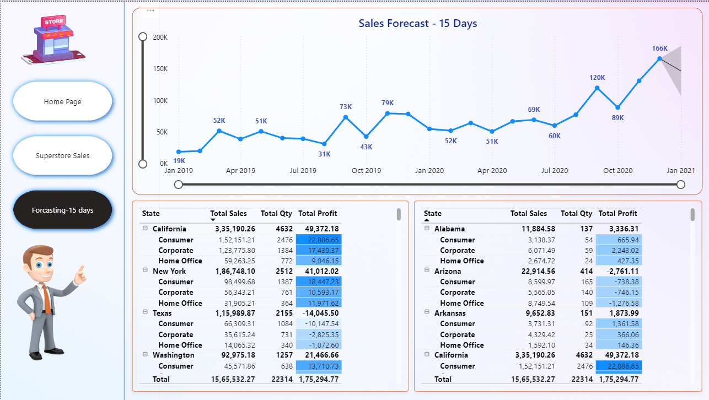

# 📊 Superstore Sales & Performance Power BI Dashboard

This project showcases an interactive Power BI dashboard built on the Superstore dataset. It delivers insights into sales, profit, customer behavior, category trends, and regional performance using advanced DAX, drillthrough, and visual storytelling.

---

## 🎯 Objective

To build a professional-level dashboard that helps analyze and visualize Superstore’s business performance across multiple dimensions with clean UI/UX, dynamic interactions, and key KPIs.

---

## 📁 Dataset Description

- **Source**: Sample Superstore dataset  
- **Records**: ~10,000 orders  
- **Key Fields**: Order Date, Sales, Profit, Discount, Category, Sub-Category, Customer, Segment, Region, State

---

## 🛠 Tools & Technologies Used

- Power BI Desktop + Power BI Service (Premium per user)
- DAX (Data Analysis Expressions)
- OneDrive (for refreshable source)
- GitHub (for portfolio hosting)
- PowerPoint Export (offline showcase)

---

## 🧩 Dashboard Pages & Key Features

### 🔹 Home Page
- Vertical navigation panel
- Clickable buttons for each analysis page
- Reset filter bookmarks

### 🔹 Executive Summary
- KPIs: Sales, Profit, Orders, Discount %
- Monthly trends and region/category summaries

### 🔹 Customer Analysis
- Dynamic top N customer ranking
- Customer segmentation and engagement logic

### 🔹 Category & Sub-Category Analysis
- Category-wise sales/profit tree maps
- Discount vs. Profit logic
- Drillthrough enabled

### 🔹 Sub-Category Drillthrough
- YoY% sales growth, monthly breakdown
- Reset bookmark on return

### 🔹 Location Analysis
- Map of State/Region-level performance
- Profit-to-discount ratio
- Least engagement logic by region

---

## 🧮 Key DAX Measures

- `YoY Sales Growth %`
- `Top N Customers by Sales`
- `Average Discount by Category`
- `Profit to Discount Ratio`
- `Least Engagement Region`

---

## 🔐 Row-Level Security (RLS)

- Implemented RLS in Power BI Desktop (Region-based role filter)
- Disabled in Power BI Service for public viewing

---

## ☁️ Power BI Service Integration

- Report published to Power BI workspace with Premium per user license
- Created App for internal sharing
- Exported to PowerPoint for portfolio use
- Scheduled refresh using OneDrive integration (trial-based)

---

## 📸 Screenshots

### 🏠 Home Page  

### 📊 Executive Summary  

### 🌍 15 Days Forcast  

---

## 📁 Dataset

- 📄 [Superstore.csv](Superstore.csv)

---

## 🚀 Outcome & Learning

- End-to-end Power BI project development
- Advanced DAX application
- UI/UX storytelling using drillthrough, bookmarks, and navigation
- Full understanding of Service features, RLS, refresh, and export

---

## 🔗 Links

- 🔎 Power BI App: *Access restricted to org users only*  
- 📄 [PowerPoint Export](https://docs.google.com/presentation/d/1wUk0hlQo9fRObBFRDFo4DBMBoflKJsJ6/edit?usp=drive_link&ouid=105620746628215143734&rtpof=true&sd=true)  
- 📁 Dataset: [Superstore.csv](Superstore.csv)  
- 📺 Walkthrough Video: [Add if available]

---

## 👤 Author

**Piyush Kadam**  
📧 piyushkadam4484@gmail.com  
🔗 [LinkedIn](https://www.linkedin.com/in/piyushkadam4)  
💻 [GitHub](https://github.com/your-username)

---

> 📌 _Note: Due to Power BI licensing restrictions, the interactive app link is only available for logged-in users within the same organization. For public view, please see screenshots and PowerPoint export._
